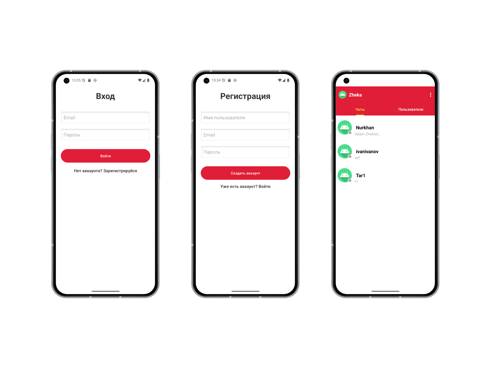
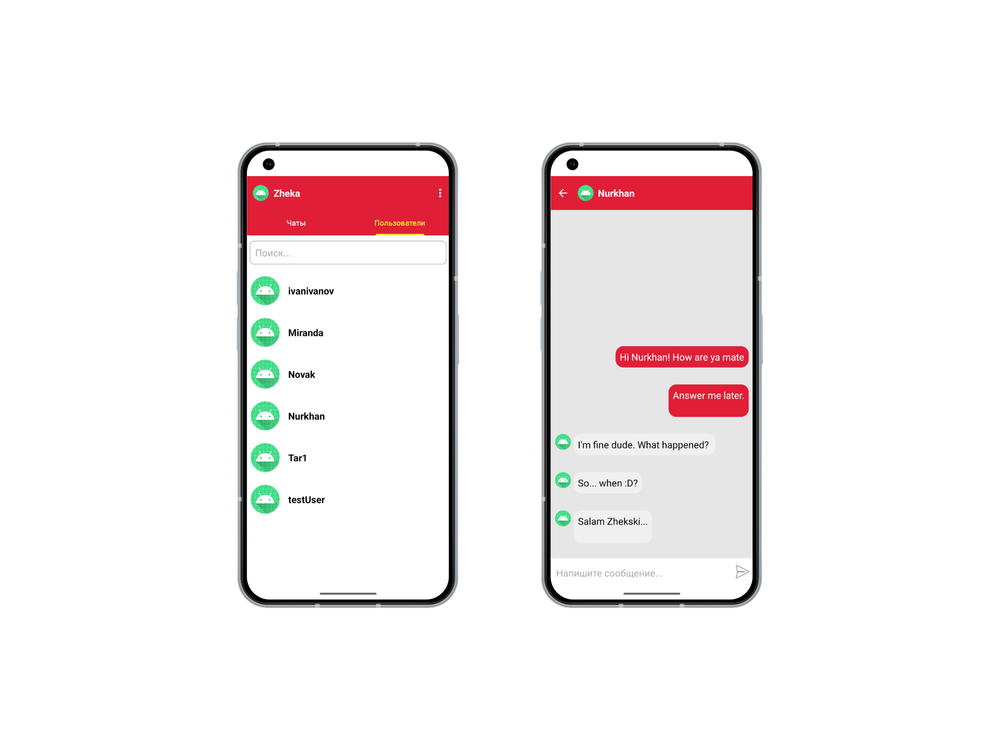

Scarlet Messenger (MVP)
Грациозный ало-белый мессенджер на базе Material Design 3. Проект демонстрирует навыки работы с Firebase и современными Android-архитектурами.

✨ Основные фишки:
Real-time Chat: Мгновенный обмен сообщениями через Firebase Realtime Database.

Smart Search: Поиск пользователей по никнейму.

Online/Offline Status: Индикация присутствия пользователя в сети. 

Message Management: Удаление сообщений и отображение времени отправки.

Offline Support: Возможность просматривать чаты без доступа к интернету.

Auth: Полноценная регистрация и авторизация.

🛠 Стек технологий:
Language: Java (Android SDK)

Architecture: Single Activity App (Navigation Component)

Design: Material 3, CircleImageView, Glide

Backend: Firebase (Auth, Database, Cloud Messaging)


  



  
